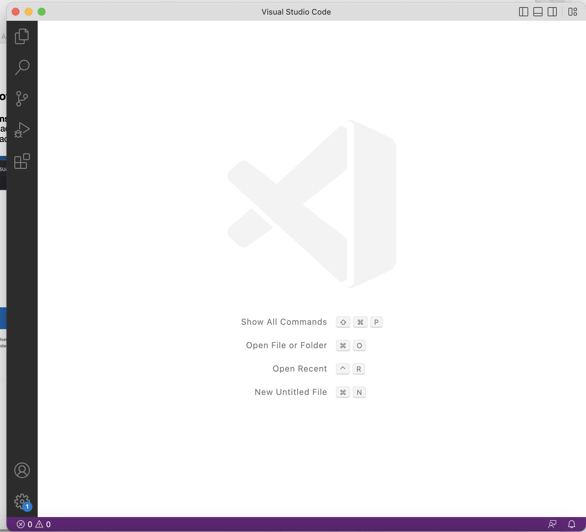
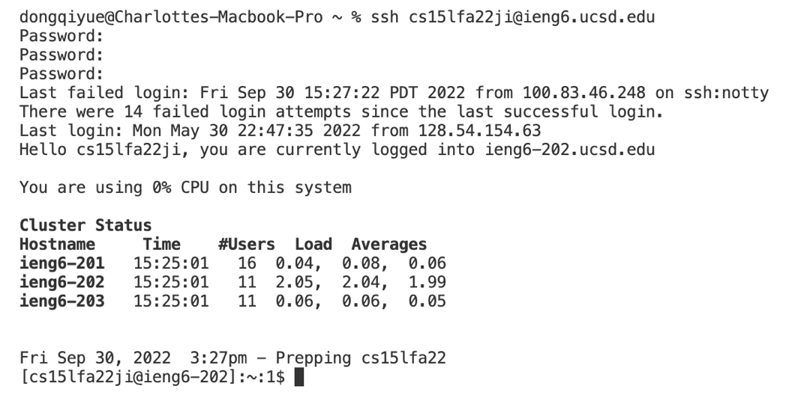
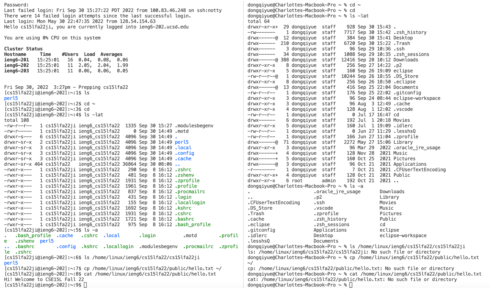
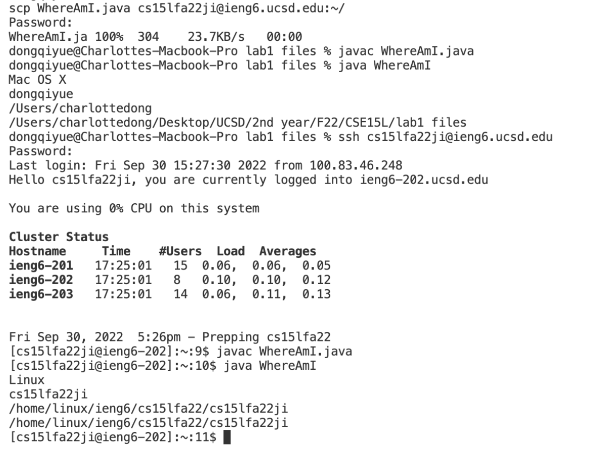
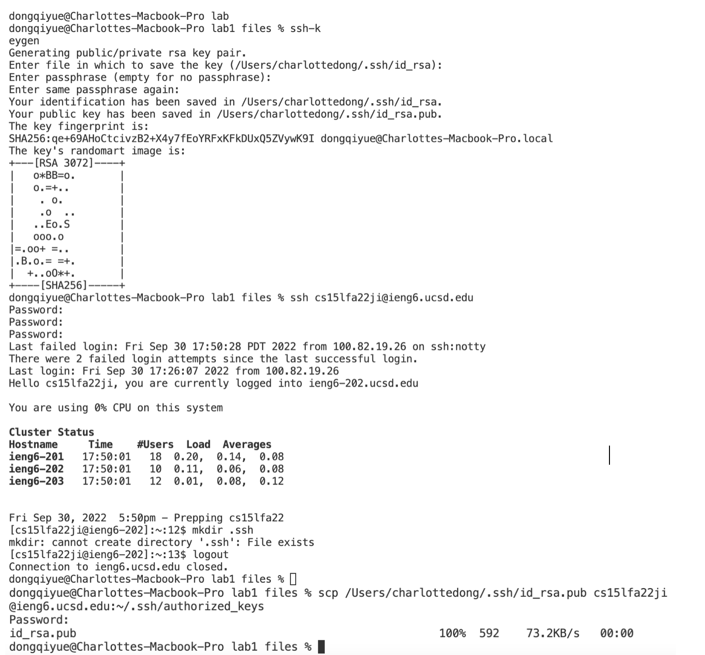
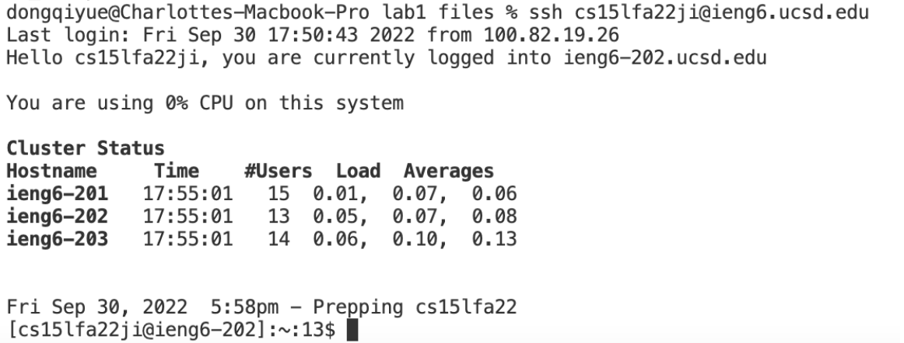
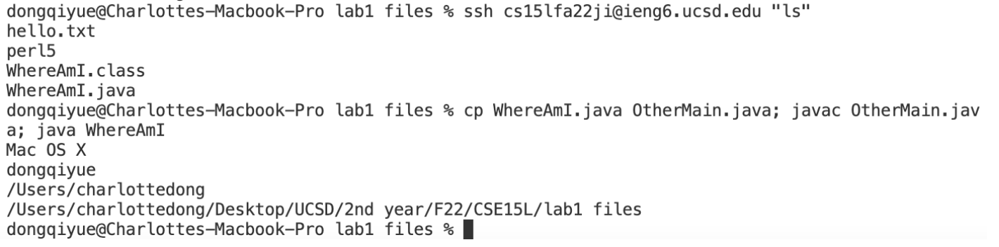

# Charlotte Dong Lab Report2 (Week1)  
  
## Step 1 Installing VSCode  
* Download **Visual Studio Code** from the [official website](https://code.visualstudio.com/download). 
* Open it, you should see a window like the screenshot below.  
  
  
  
    
## Step 2 Remotely Connecting   
* Ssh into your course-specific account using command: **$ ssh cs15lfa22ji@ieng.ucsd.edu**, but with **ji** replaced by your own course-specific account.   
* If this is your first time connection to this server, reply **yes** to the question **"Are you sure you want to continue connecting (yes/no/[fingerprint])?"**  
* If you see the successful login message as below, your computer (client) is connected to the server in the CSE basement.  
  
  
  

    
## Step 3 Trying Commands  
* Try running some commands on the server and on your personal computer. Here are some useful commands to try:  
**cd ~**  
**cd**  
**ls -lat**  
**ls -a**   
**ls /home/linux/ieng6/cs15lfa22/cs15lfa22abc** where abc should be replaced by your or your friend's username  
**cp /home/linux/ieng6/cs15lfa22/public/hello.txt ~/**  
**cat /home/linux/ieng6/cs15lfa22/public/hello.txt**  
* In summary:  
**cd** ("change directory") is used to switch the directory you are working from  
**ls** ("list") is used to list the files in the current directory  
**cp** ("copy") is used to copy file to another directory  
**cat** ("concatenate") is used to print contents of the file(s)  
* Below is an example of the terminal after trying out these commands. The terminal on the left should be similar to the command tryout using the server; the terminal on the right should be similar to the tryout using your personal computer.  

   
  
  

## Step 4 Moving Files with scp  
* Create a java file on **your computer** called **WhereAmI.java**, compile and run it.  
* Now try this command: **scp WhereAmI.java cs15lfa22ji@ieng6.ucsd.edu:~/**, you should be asked to input your password just like ssh login.  
* Then log in with **ssh** and use **ls**. You should find the file in your home directory.  
* This **scp** ("secure copy") command copies file from one computer to another. In this case, it copies the WhereAmI.java file from your local computer to the remote server.  
* The WhereAmI code should work the same both local and remote, but the printed out results are different. When you run this on the client, your local system name, username and directory gets print out; but when you run this on the server, the remote system name, username and directory gets print out.  
  
 
  

## Step 5 Setting an SSH Key  
* In order to avoid repetitive work, we could use **ssh-keygen** to ssh without typing your password.  
* On your computer, type **$ ssh-keygen**, then follow the prompt instructions to complete the process. Note that when you run into **"Enter file in which to save the key (/User/joe/.ssh/id_rsa):"**, press enter again.  
* On client, **$ ssh cs15lfa22ji@ieng.ucsd.edu**, enter your password. Then on server, type **mkdir .ssh**, logout. Then on client again, **scp /Users/joe/.ssh/id_rsa.pub cs15lfa22@ieng6.ucsd.edu:~/.ssh/authorized_keys**, use your username and path.  
* The first screenshot below is the setup process for an ssh key. Once its setup, you should be able to log in without password.  
  
  
  
**After completing the above steps, you could login to your account without password, and the process should be similar to mine in the screenshot below.**  
  

  

## Step 6 Optimizing Remote Running  
* Now try some efficient commands:  
**ssh cs15lfa22ji@ieng.ucsd.edu "ls"** : this command automatically ssh into your account and list home directory of the remote server.  
**cp WhereAmI.java; javac WhereAmI.java; java WhereAmI** : using **";"** allows you to run multiple commands in one line.  
**Up arrow on your keyboard allows you to recall previous commands.**  
* The screenshot below demonstrate the efficient commands mentioned above.  
  
  

  