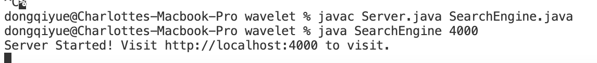
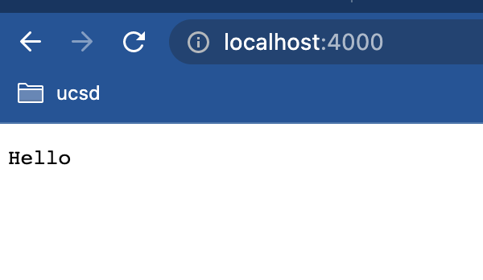
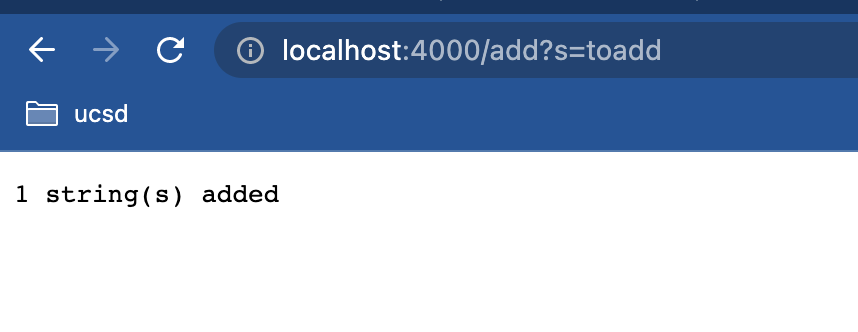
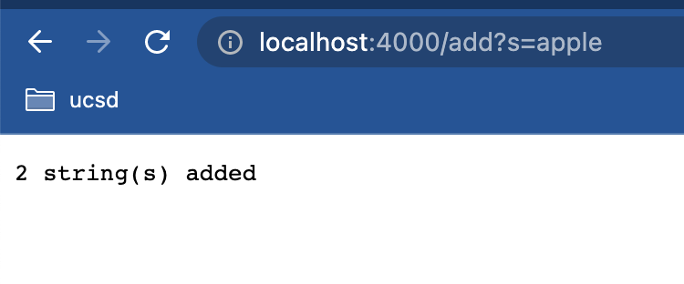
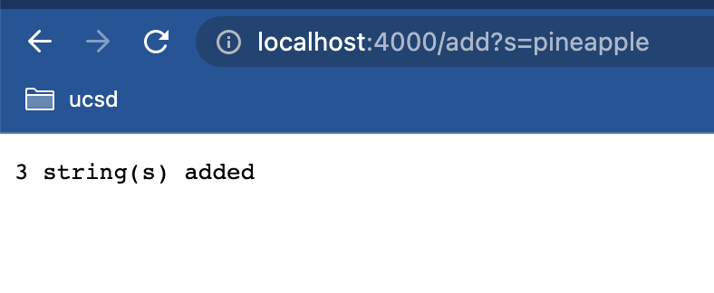
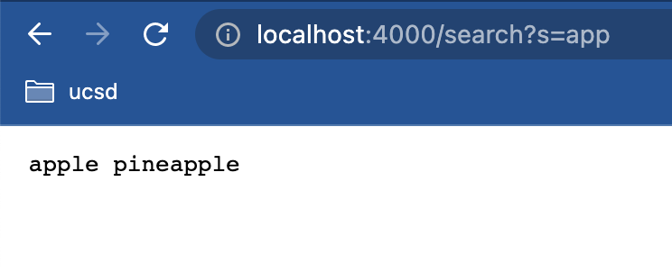
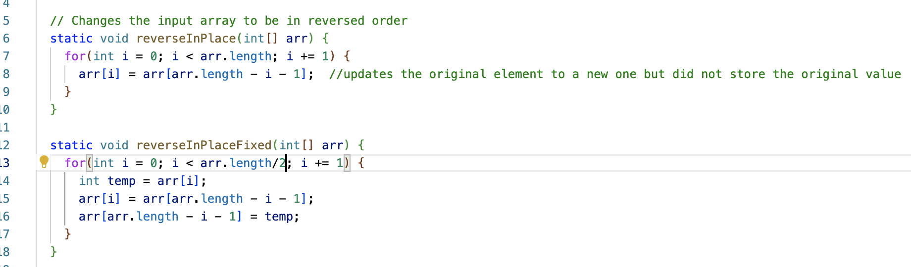
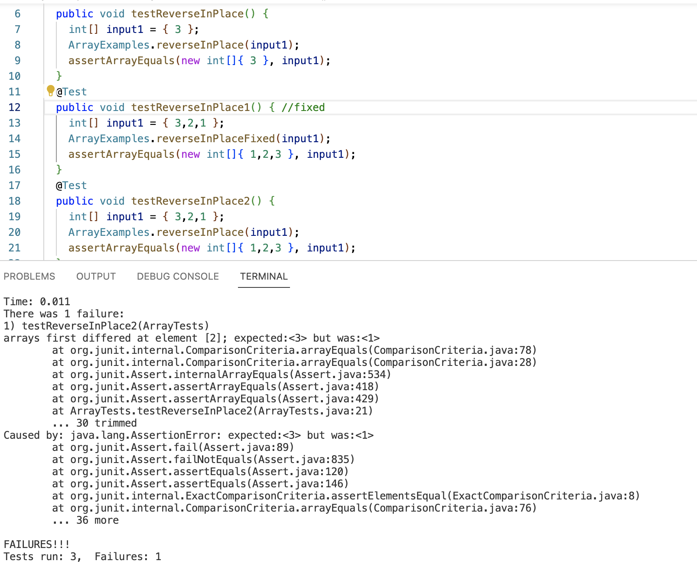
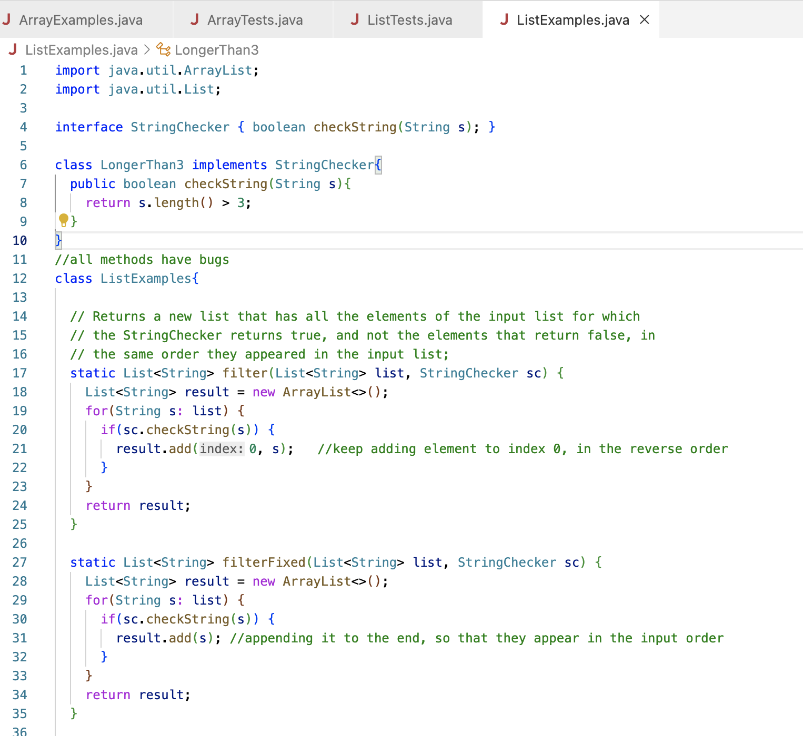
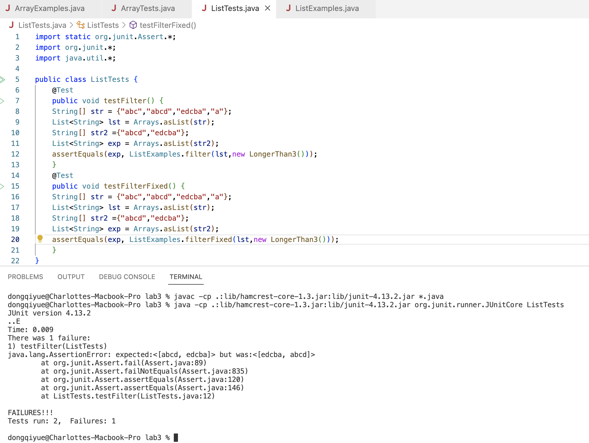

# Charlotte Dong Lab Report3 (Week3)  
  
## Part 1 Simplest Search Engine (Week2)  
* Based on what we learned from lab2, we can create the simplest search engine. First, make a new file called **SearchEngine.java**, which should implement a web server. For example, I implemented **Server.java** in the wavelet repository.  
* This **SearchEngine.java** supports a path for adding new strings to the list as well as a path for searching and returning all strings containing a given substring.  
* Below is my code:  
  
```
class Handler implements URLHandler {

    ArrayList<String> lst = new ArrayList<>();
    int count = 0;

    public String handleRequest(URI url) {
        if (url.getPath().equals("/")) {
            return "Hello";
        }
        else if (url.getPath().contains("/add")) {
            String[] newstr = url.getQuery().split("=");
            for (int i = 1; i<newstr.length; i+=1){
                lst.add(newstr[i]);
                count += 1;
            }
            return count + " string(s) added";
        }
        else {
            System.out.println("Path: " + url.getPath());
            if (url.getPath().contains("/search")) {
                String[] parameters = url.getQuery().split("=");
                String toReturn = "";
                if (parameters[0].equals("s")) {
                    for (String s : lst){
                        if (s.contains(parameters[1])){toReturn += " " + s;}
                        else {continue;}
                    }
                    return toReturn;
                }
            }
            return "404 Not Found";
        }
    }
}
```  
```
class SearchEngine {
    public static void main(String[] args) throws IOException {
        if(args.length == 0){
            System.out.println("Missing port number! Try any number between 1024 to 49151");
            return;
        }

        int port = Integer.parseInt(args[0]);

        Server.start(port, new Handler());
    }
}
```  
* To build and run the server, type **javac Server.java SearchEngine.java** and **java SearchEngine 4000** at the next line. This calls the **SearchEngine** and starts a new server. Your terminal should be similar to this:  
  
  
  
* Then visit the link from your browser. The webpage should display **Hello** since you are at the root directory. You should see something like this:  
  
  
  
* To test your code, try some path and queries examples as below:  
```
/add?s=toadd  
/add?s=apple  
/add?s=pineapple  
/search?s=app  
```  
* **/add?s=toadd** calls the **handleRequest** method in class **Handler**. Since the **else if** statement is met, the method will add the new string to the end of the **String ArrayList lst** (which now contains **"toadd"**)and update the **int count** field to **1**, then display **1 string(s) added**.  
  
  
  
* Similarly, **/add?s=apple** calls the **handleRequest** method in class **Handler**. Since the **else if** statement is met, the method will add the new string to the end of the **String ArrayList lst** (which now contains **"toadd"** and **"apple"**) and update the **int count** field to **2**, then display **2 string(s) added**.  
  
  
  
* Like the previous ones, **/add?s=pineapple** calls the **handleRequest** method in class **Handler**. Since the **else if** statement is met, the method will add the new string to the end of the **String ArrayList lst** (which now contains **"toadd"**, **"apple"** and **pineapple**) and update the **int count** field to **3**, then display **3 string(s) added**.  
  
  
  
* Now **/search?s=app** does something different. It calls the **handleRequest** method in class **Handler**, but meets the **else** statement. The method will loop through all elements in the **String ArrayList lst** and return the elements that contains **"app"**, in this case, it should return **apple** and **pineapple**.  
  
  
  
  
## Part 2 Debugging reverInPlace in ArrayExamples.java (Week3)  
* **reverseInPlace method in ArrayExamples overview:** This method is designed to reverse the order of elements in the array, but failed to do so because it tried to update the element to a new value without store its original value first, so for an input array with size larger than 0, its output of this method should be a mirrored array with the original second half values on both sides.  
  
* **Failure-induced input:** In this case, **int[] input1 = { 3,2,1 }** and **ArrayExamples.reverseInPlace(input1)** in **testReverseInPlace2**.  
```
@Test 
	public void testReverseInPlace2() {
    int[] input1 = { 3,2,1 };
    ArrayExamples.reverseInPlace(input1);
    assertArrayEquals(new int[]{ 1,2,3 }, input1);
	}
```  
* **Symptom:** In the test shown above, the expected and the actual **differed at index 2**, **expected 3 but was 1**. The entire **expected** output is **{1,2,3}** while the **actual** output is **{1,2,1}**.  
  
* **Bug:** The bug is at the line `arr[i] = arr[arr.length - i - 1];` in the original method.    

* **Fixed code:**  To fix the code, create an int variable **temp** inside the for loop to **store the original value** of the element, and change the iteration of **i** to `i < arr.length/2 `. Below is the fixed code and a screenshot that compares the original method and the fixed method:  
```
static void reverseInPlaceFixed(int[] arr) {
    for(int i = 0; i < arr.length/2; i += 1) {
      int temp = arr[i];
      arr[i] = arr[arr.length - i - 1];
      arr[arr.length - i - 1] = temp;
    }
```  
  
  
  
* **ArrayTests:** (testReverseInPlace1 is the passed test of the fixed method; testReverseInPlace2 is the failed test of the original method)  
  
  
  
* **Explanation:** Looping through the array, the bug `arr[i] = arr[arr.length - i - 1]` tries to update the original element to the element at its reversed position **without storing the value of the original element first**, so the original value of the first half of the array is lost. Therefore, the output of this method is basically a mirrored array with the second half values of the orginal array on both sides. So in the case of **testReverseInPlace2**, the actual output is {1,2,1} instead of the expected {1,2,3}.  
  
    

## Part 3 Debugging filter in ListExamples.java (Week3)  
* **filter method in ListExamples overview:** This method is designed to **return a new list** of elements containing elements that return **true** for **StringChecker** in the same order as tehy appeared in the original list. But it failed to do so because it keep adding elements that return true at the beginning of the new list instead of at the end. (My implementation of StringCheker is to check whether the string **is longer than 3 characters**.)  
  
* **Failure-induced input:** In this case, `ListExamples.filter(lst,new LongerThan3())` in **testFilter**.  
```
@Test 
public void testFilter() {
    String[] str = {"abc","abcd","edcba","a"};
    List<String> lst = Arrays.asList(str);
    String[] str2 ={"abcd","edcba"};
    List<String> exp = Arrays.asList(str2);
    assertEquals(exp, ListExamples.filter(lst,new LongerThan3()));
}
```  
  
* **Symptom:** In the test shown above, the expected and the actual differed, **expected ["abcd","edcba"], but was ["edcba","abcd"]**.  
  
* **Bug:** The bug is at the line `result.add(0, s);` of the original method.  
  
* **Fixed code:** To fix the code, simply change `result.add(0, s);` to `result.add(s);` so that the element **gets added to the back** and **displays in the order of appearance in the original list**. Below is the fixed code and a screenshot that compares the original method and the fixed method:  
```
static List<String> filterFixed(List<String> list, StringChecker sc) {
    List<String> result = new ArrayList<>();
    for(String s: list) {
      if(sc.checkString(s)) {
        result.add(s); 
      }
    }
    return result;
}
```  
  
  
  
* **ListTests:** (testFilterFixed is the passed test of the fixed method; testFilter is the failed test of the original method)  
  
  
  
* **Explanation:** Looping through elements in the original list, the original filter method checks if an element returns true for StringChecker, and if so, `result.add(0, s);` **add it to index 0 (the beginning)** of the new list, instead of appending it to the end. Therefore, the output of the input of [abc","abcd","edcba","a"] in **testFilter** will return ["edcba","abcd"] instead of the expected ["abcd","edcba"].  
  
  


