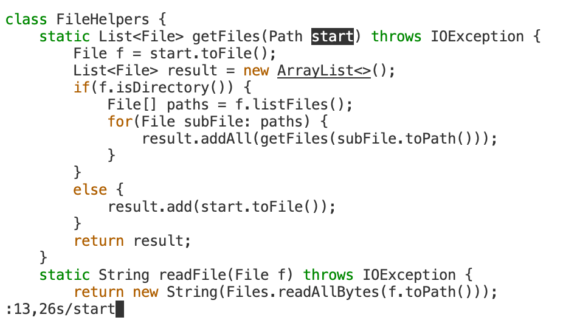
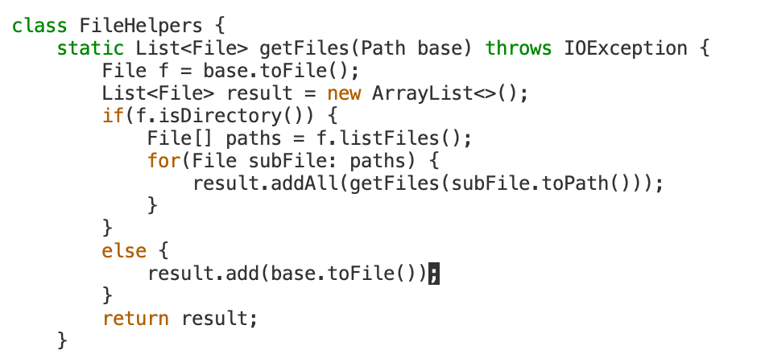

# Charlotte Dong Lab Report5 (Week7)  
  
## Part 1  
* In this part, I will be describing the process of **task 1**, which changes the name of the **start** parameter of **getFiles** to instead be called **base**.  
* First, **ssh** into your remote server, then clone this repository to your remote server **git clone https://github.com/ucsd-cse15l-f22/skill-demo1 week6-skill-demo1**. Then **cd** into **week6-skill-demo1**, and use **vim DocSearchServer.java** to open the file using **vim**.  
* Our group found out a way to change all occurences of a word to a new one using one comman only. Try:  
```
:13,26s/start/base/g<enter>
```
You should be typing something like the screenshot below:  
  
* What this command does is that it first narrow down the line numbers to **13 to 26**, which are the line numbers of the method getFiles, then **locates** all occurrences of **start** and then **changes** every **start** it locates to **base**.  
* Let me break it down the command for you. **:13,26s/** is narrowing the range of search to line **13 to 26**, which is the line number of the method getFiles.  
* **:13,26s/start** is **locating all occurences of start** in these lines. By typeing this, the cursor will lead you to the first ocurence of start, which is at the input parameter part. You should see the first **start** gets highlighted just as shown below.  
  
* **:13,26s/start/base/g** is ready to scan through all lines within the range of **line 13 to 26** then change all occurrences of **start** to **base**.  
* After hitting **enter**, you should see all **start** paramters in getFiles method are changed to **base**, like the screenshot below:  
  
  
  
## Part 2
