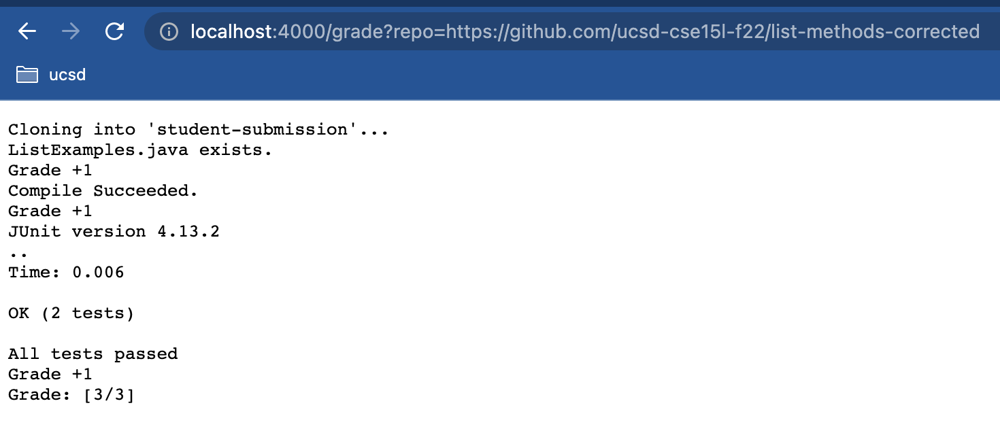
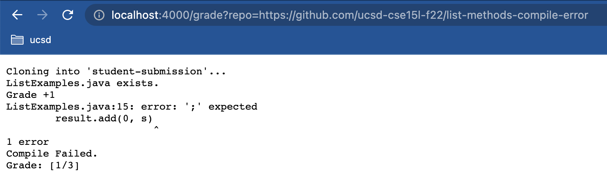
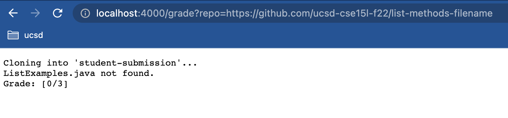

# Charlotte Dong Lab Report6 (Week9)  
  
In week 7 and 8, we learned how to create our own "autograder" using bash script as well as how to run it on remote server. In this lab report, I will be demonstrating how I completed the grading script assignment using several student submissions.  

## Grading Script Code  
First, we should write the bash script. Below is the grading script I wrote. Similar to mine, yours should also give feedback on all student submissions as well as making judgemental calls about which ones to receive credit or not.  
  
```
rm -rf student-submission
git clone $1 student-submission

grade=0

FILE1="ListExamples.java"
TESTFILE="TestListExamples.java"
TESTFILECLASS="TestListExamples.class"
CPATH=".:../lib/hamcrest-core-1.3.jar:../lib/junit-4.13.2.jar"

cp $TESTFILE ./student-submission/

#check if file exists
if [ -f ./student-submission/$FILE1 ]
then 
    echo "$FILE1 exists."
    echo "Grade +1"
    ((grade++))
else 
    echo "$FILE1 not found."
    echo "Grade: [$grade/3]"
    exit 1
fi

cp $TESTFILE ./student-submission/
cd student-submission
javac -cp $CPATH *.java

#check if file compiles
if [[ $? -eq 0 ]]
then 
    echo "Compile Succeeded."
    echo "Grade +1"
    ((grade++))
else
    echo "Compile Failed."
    echo "Grade: [$grade/3]"
    exit 1
fi

#check if pass tests
java -cp $CPATH org.junit.runner.JUnitCore TestListExamples 2> out-err.txt
if [ $? -eq 0 ]
then 
    echo "All tests passed"
    echo "Grade +1"
    ((grade++))
else
    echo "Failed test(s)"
fi

cat out-err.txt

echo "Grade: [$grade/3]"
```  
  
## 3 Sample Submission Grade Report  
After writing the grading script, let's test it out by grading several student sample submissions.  
* The [first student submission](https://github.com/ucsd-cse15l-f22/list-methods-corrected) has all **corrected methods**, so it should receive a perfect or nearly perfect grade. Below is the screenshot of its grade report. Notice that this submission received a **3/3**, since it contains the file **ListExamples.java**, **compiles sucessfully**, and passed the two tests I wrote.  
    
  
  
* The [second student submission](https://github.com/ucsd-cse15l-f22/list-methods-compile-error) has a **syntax error** of a missing semicolon, which should cause a compule error. Below is the screenshot of its grade report. Notice that it only received one point for **containing ListExamples.java file**, but did not receive any other points since there is a **compile error** and the grading script exited right after it failed to compile.  
  
  
  
* The [third student submission](https://github.com/ucsd-cse15l-f22/list-methods-filename) has a great implementation **saved in a file with wrong name**. Below is the screenshot of its grade report. Notice that it received **0/3 points**, since my grading script **first checks for the existence of the file ListExamples.java** and then check for other aspects. In this case, no such file with name ListExamples.java exists, the program exits early and the student receives 0 points.   
  
  
  
  
## Tracing through the third student submission  
  
* Reminder: as mentioned previously, the third student submission has a **wrong file name**.  
* Let's trace through the student submission using my grading script. First, my script **removes the current student-submission file** and **git clones** the third student's repository as the current student-submission. Then initializes the variable **grade=0** and **copies the test file TestListExamples.java into student-submission**.  
* Then at the line **if [ -f ./student-submission/$FILE1 ]**, it checks if $FILE1, which is **ListeExamples.java**, exists in the directory **./student-submission/**, this if condition is **false**, since the student saves the implementations under a file with wrong name. Thus the **then branch** with two echos **doesn't run**.  
* The **else branch with two echos runs**. It runs the first echo line **echo "$FILE1 not found."**, which is shown in the Server output as **"ListExamples.java not found."**. Then runs **echo "Grade: [$grade/3]"**, which prints the student's current grade **Grade: [0/3]** in the Server. Finally, the program exits early at the line **exit 1**.  
* The rest of the grading script don't run, since the program exits early in the first else branch (line 22) **exit 1** when no file of name **ListExamples** were found under the directory **./student-submission/**.  
  
  
  
